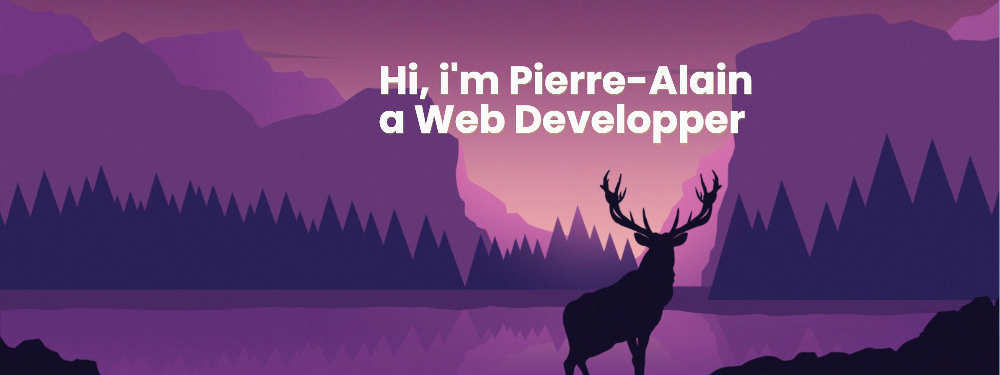
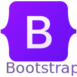

<h3 align="center">About me :loudspeaker:</h3>

I learn new cool things every day, and I try to implement them in my projects. I'm a web developer since 3 years, and I'm passionate about 3d printing and everything that will be diy home automation, using raspberry or arduino

Here are not all my projects, some kept secret by employers

In parallel, I create small videos of my hikes or inspiration of the moment on TikTok & Insta 

 
<h3 align="center">Techno :space_invader:</h3>

 

 
 
 
<a href="#" target="_blank"> <a> 
 
 
 
 
 
 
 
 
 
 
 
 
 
 
 
  

 
<h3 align="center">My Github Stats :chart_with_upwards_trend:</h3> 
 

 
<h3 align="center">Look it's like 00' but with git contribution</h3>
 

  

 
<h3 align="center">Connect with me: :star:</h3>
 

 
<h3 align="center">Activty git :battery:</h3>
 

